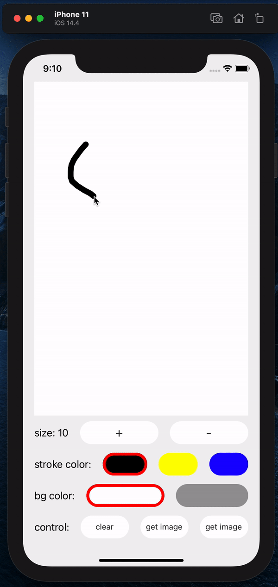
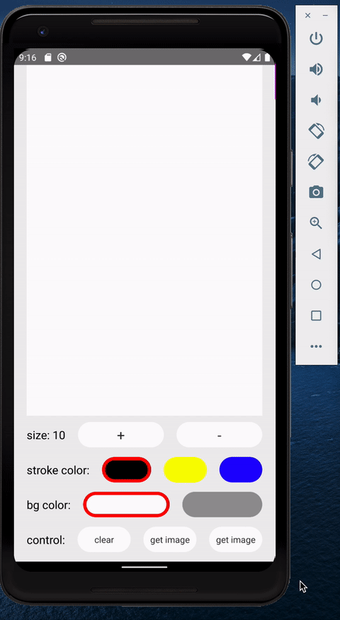

# react-native-signature-board
A simple writing pad or doodling board that you can use in some programs that require a customer's signature for certainty.
Many of the applications I've worked with require a signature confirmation (I'm not sure if it's legally valid). But in the react-native library, a lot of this kind of functionality is implemented using webview. That's why I'm sharing the library I wrote in my business.

## Installation

```sh
yarn add signature-board

// ios
cd ios 
pod install

```
## example
* IOS demo  
  

* android demo  
  


## Usage
```js
import { SignatureBoard, SignatureRef } from 'signature-board'
const drawRef = React.useRef<SignatureRef | null>(null)
const Func = ()=>{
  return(
    <SignatureBoard
        ref={drawRef}
        style={{ width:"100%",height:"100%" }}
        bgColor="#FFFFFF"
        lineColor="#000000"
        lineWidth={10}
        onImageFinish={(base64:string) => {
          // base64 image
        }}
      />
  )
}
```
See example for more details
更多细节查看 examples 目录
```sh
cd example
yarn
yarn run android 
yarn run ios
// maybe you should 
cd ios
pod install
```

## Properties

### style
As with a normal view, you can set the corresponding style, but it's best not to set the background-related properties, because the bgColor property overrides all of that.

### bgColor / lineColor
For the background color and brush color properties of the panel, note that this must be a **HEX String**. you can type `#FFF` or `#FFFFFF`. but you cannot use `#AAFFFFFF` with an alpha channel. Always remember to use the `#` prefix

### lineWidth
Brush size property

### ref 

The `SignatureRef` object has two commands: one is `clear()` , and the other is `getImage(opaque: boolean)`. 
* `clear()` will get your panel back to just the background。
* `getImage(opaque: boolean)` will get the native to export the image. `opaque` is whether you want an opaque background or not. But unfortunately, you can't get any image data in this method.

### onImageFinish

This method is used to listen to the native side to generate base64 images. This means that if you call `ref?.current.getImage()` and wait for the image to be generated here.  

A very strange calling scheme. But I can't get getImage to have a callback method in the methods provided by react-native. So this is the only way to do it.   
Just like this [issues](https://github.com/facebook/react-native/issues/30587) says

## 属性

### style
和普通视图一样，可以设置相应的样式，但最好不要设置背景相关的属性，因为bgColor属性会覆盖所有这些。

### bgColor / lineColor
写字板的背景色和笔刷色属性，请注意必须是**HEX string**。你可以输入`#FFF`或`#FFFFFF`。但你不能使用`#AAFFFFFF`与alpha通道。请务必记住使用 `#` 前缀。

### lineWidth
画笔大小

### ref
`SignatureRef` 的对象，拥有两个方法: 一个是 `clear()` , 而另一个是 `getImage(opaque: boolean)`。
* `clear()` 能让你的画板回到只有背景色的时候，
* `getImage(opaque: boolean)` 则会让 `native` 把图片导出，`opaque` 是指是否需要不透明背景。但你不能在这个方法中拿到任何图片的数据。

### onImageFinish
这个方法是用来监听原生端生成base64图像的。这意味着，如果你调用`ref?.current.getImage()`，并在这里等待图像的生成。   
一个很奇怪的调用方案。但是在 react-native 提供的方法中，我无法让 getImage 有回调方法。所以只有这样做了。    
详情请看这里 [issues](https://github.com/facebook/react-native/issues/30587) 

## License

MIT
